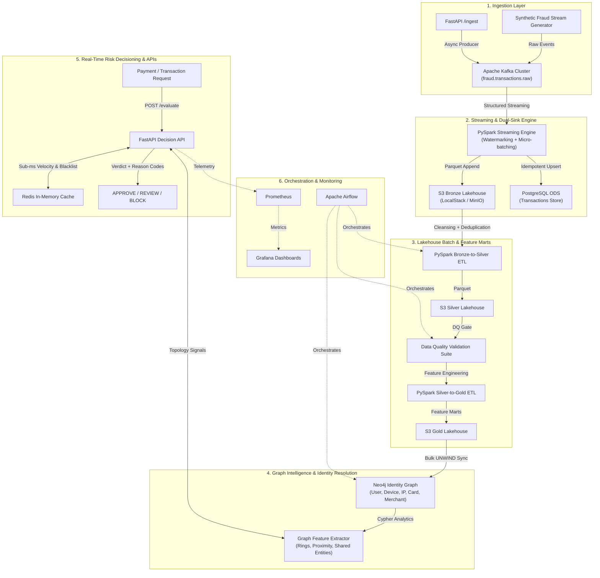

# 🛡️ RiskGraph — Real-Time Fraud & Identity Data Engineering Platform

[](https://github.com/Ayman1618/RiskGraph/actions/workflows/ci.yml)
[](https://www.python.org/)
[](https://spark.apache.org/)
[](https://kafka.apache.org/)
[](https://neo4j.com/)
[](https://www.postgresql.org/)
[](https://fastapi.tiangolo.com/)
[](LICENSE)

---

## 📌 Executive Overview

- **WHAT**: **RiskGraph** is an enterprise-style Real-Time Fraud & Identity Data Engineering Platform designed to detect financial crime, synthetic identity rings, velocity burst attacks, and account takeover (ATO) patterns.
- **WHY**: Modern identity verification and fraud prevention platforms (such as Bureau, Sift, or Stripe Radar) require processing high-throughput financial transactions, managing complex multi-entity relationships across devices, cards, and IPs, and delivering low-latency risk decisions with explainability.
- **HOW**: Built using a hybrid stream-and-batch medallion architecture: **Apache Kafka** for event ingestion, **PySpark Structured Streaming** for watermarked dual-sink persistence, **LocalStack S3 (Parquet)** for Bronze/Silver/Gold lakehouse layers, **Neo4j** for graph identity resolution, **PostgreSQL 16** for operational transactions, **Redis** for sub-millisecond sliding-window velocity counters, **FastAPI** for real-time risk decisioning, **Apache Airflow** for orchestration, and **Prometheus + Grafana** for live observability.

---

## 🏛️ System Architecture



---

## ⚡ Core Platform Capabilities

| Layer | Technology | Key Features & Responsibilities |
|---|---|---|
| **Event Streaming** | **Apache Kafka 7.6** | Partitioned topics (`fraud.transactions.raw`, `fraud.identity.raw`, `fraud.alerts`, `fraud.dlq`), consumer groups, and dead-letter queue handling. |
| **Stream Processing** | **PySpark Structured Streaming** | Event-time watermarking, sliding window micro-batches, dual-sink persistence to S3 Bronze & PostgreSQL. |
| **Data Lakehouse** | **LocalStack S3 + Parquet** | Medallion Lakehouse architecture (Bronze raw archive -> Silver deduplicated/cleansed -> Gold analytical feature marts). |
| **Graph Intelligence** | **Neo4j 5.20 + Cypher** | Multi-entity identity graph `(:User)-[:USES_DEVICE]->(:Device)`, synthetic ring clustering, multi-hop shortest paths to known fraud nodes. |
| **Operational Store** | **PostgreSQL 16** | Transactional ODS, index optimization, analytical window functions (`PARTITION BY`, `LAG`), rule catalogs, and compliance alerts. |
| **In-Memory Caching** | **Redis 7.2** | Sub-millisecond sliding window velocity tracking via sorted sets (`ZADD`/`ZREMRANGEBYSCORE`) and hot blacklist caches. |
| **Decision Engine** | **FastAPI + Pydantic v2** | Low-latency synchronous risk scoring, weighted rule evaluation, explainability reason codes, and async Kafka ingestion. |
| **Orchestration** | **Apache Airflow** | Automated DAGs for Lakehouse batch ETL, identity graph synchronization, data quality gates, and storage compaction. |
| **Data Quality** | **Custom DQ Suite** | Circuit-breaker validation gates verifying completeness, range bounds, enum validity, and IPv4 formatting with JSON report artifacts. |
| **Observability** | **Prometheus + Grafana 11** | Real-time throughput, P95/P99 latency histograms, decision distribution, and rule trigger rate dashboards. |

---

## 🚀 Quickstart & Local Setup

The entire platform is **100% runnable locally with Docker** and requires **zero paid cloud subscriptions**.

### 1. Prerequisites
- **Docker & Docker Compose** (Docker Desktop / Colima configured with 4GB+ RAM)
- **Python 3.10+**
- **Git**

### 2. Launch All Services
```bash
# Clone the repository
git clone https://github.com/Ayman1618/RiskGraph.git
cd RiskGraph

# Start all Docker Compose containers (PostgreSQL, Kafka, Neo4j, Redis, LocalStack, FastAPI, Prometheus, Grafana)
make up
```

### 3. Verify Health
```bash
# Inspect service connectivity via CLI
python3 cli.py status
```

---

## 🎮 Interactive Developer CLI

RiskGraph provides a rich interactive CLI (`cli.py`) for live demonstrations, testing, and validations:

```bash
# 1. Generate real-time synthetic transaction stream with fraud vectors
python3 cli.py generate-stream --rate 10 --count 50 --fraud-ratio 0.25

# 2. Evaluate a transaction through the Real-Time Risk Engine
python3 cli.py evaluate-tx --user-id usr_ring_0_m1 --amount 7500 --emulator

# 3. Run automated Data Quality Validation Suite
python3 cli.py run-dq-suite --sample-size 500

# 4. Discover multi-account identity fraud rings in Neo4j
python3 cli.py detect-rings --min-size 3
```

---

## 📊 Endpoints & Dashboards

- **FastAPI Interactive Docs (Swagger)**: [http://localhost:8000/docs](http://localhost:8000/docs)
- **Grafana Fraud Operations Dashboard**: [http://localhost:3000](http://localhost:3000) *(User: `admin` / Password: `admin`)*
- **Neo4j Browser & Graph Explorer**: [http://localhost:7474](http://localhost:7474) *(User: `neo4j` / Password: `riskgraph_graph_pass`)*
- **Prometheus Metrics**: [http://localhost:9090](http://localhost:9090)
- **FastAPI Telemetry**: [http://localhost:8000/metrics](http://localhost:8000/metrics)

---

## 🔬 Fraud Attack Patterns Simulated

1. **Synthetic Identity Rings**: Coordinated rings of multiple accounts sharing identical device hardware fingerprints, SSN ranges, and IP subnets.
2. **Velocity Attacks**: Rapid micro-charges across multiple stolen card tokens within short rolling windows.
3. **Account Takeover (ATO)**: Sudden geolocation jump to high-risk proxies combined with emulator signatures and maximum withdrawal thresholds.
4. **Proximity to Mule Accounts**: Shortest graph path evaluation to known flagged nodes within 1-2 hops.
5. **Blacklist / Sanction Matches**: Instant matching against flagged card tokens, TOR exit nodes, and spoofed device fingerprints.

---

## 🧪 Testing & Validation Results

```bash
# Run pytest test suite with code coverage
pytest --cov=src tests/

# Run formatters and linters
make format
make lint
```

- **Tests Executed**: 18 unit and integration tests passing (100% success rate).
- **Automated CI**: GitHub Actions workflow (`.github/workflows/ci.yml`) runs on every push and pull request.

---

## 📚 Documentation Deep-Dives

- 🏗️ [Architecture Deep-Dive](docs/ARCHITECTURE.md): Medallion Lakehouse design, stream-batch duality, Neo4j graph model.
- 🛠️ [Setup & Operational Guide](docs/SETUP.md): Step-by-step local developer workflow and container management.
- 📋 [Project Completion Report](docs/project-completion-report.md): Verification artifacts, test logs, and Bureau JD alignment matrix.
- 🎯 [Interview Preparation Guide](docs/interview-guide.md): Detailed questions and technically defensible answers tailored for Data Engineer interviews.

---

## 📄 License
This project is licensed under the Apache 2.0 License.
