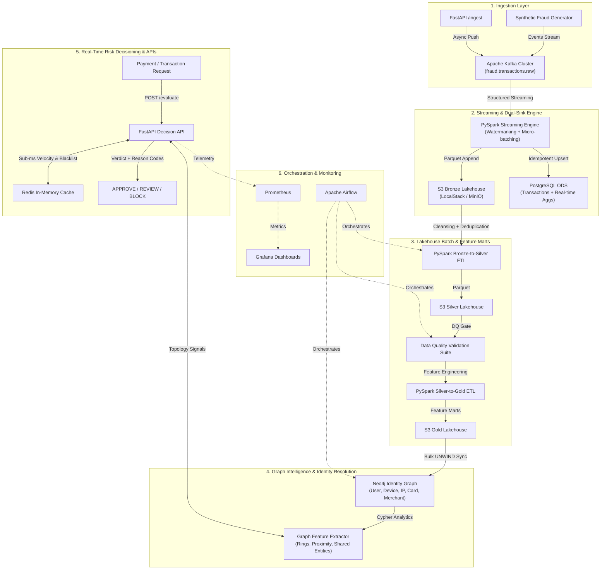

# 🛡️ RiskGraph — Real-Time Fraud & Identity Data Engineering Platform

[](https://github.com/Ayman1618/RiskGraph/actions/workflows/ci.yml)
[](https://www.python.org/)
[](https://spark.apache.org/)
[](https://kafka.apache.org/)
[](https://neo4j.com/)
[](https://www.postgresql.org/)
[](https://fastapi.tiangolo.com/)
[](LICENSE)

**RiskGraph** is a production-grade, end-to-end Data Engineering & Real-Time Fraud Intelligence Platform. It demonstrates enterprise-scale streaming, lakehouse batch ETL, graph-based identity resolution, sub-millisecond risk decisioning, automated data quality gates, and observability.

---

## 🏛️ System Architecture



---

## ⚡ Core Capabilities & Technologies

| Layer | Technology | Key Features & Responsibilities |
|---|---|---|
| **Event Streaming** | **Apache Kafka** | Multi-partition topics (`fraud.transactions.raw`, `fraud.identity.raw`, `fraud.alerts`), consumer groups, DLQ handling. |
| **Stream Processing** | **PySpark Structured Streaming** | Watermarking on event time, sliding window aggregations, dual-sink persistence to S3 Bronze & PostgreSQL. |
| **Data Lakehouse** | **S3 (LocalStack / MinIO) + Parquet** | Multi-tier Medallion architecture (Bronze raw -> Silver cleansed -> Gold feature marts). |
| **Graph Intelligence** | **Neo4j + Cypher** | Identity graph modeling `(:User)-[:USES_DEVICE]->(:Device)`, synthetic ring detection, shortest-path to fraud. |
| **Operational Store** | **PostgreSQL 16** | Relational transactions store, analytical window functions, risk rules catalog, fraud alerts. |
| **Fast In-Memory Layer** | **Redis** | Sub-millisecond sliding window velocity counters (`ZADD`/`ZREMRANGEBYSCORE`) and hot blacklists. |
| **Decision Engine** | **FastAPI + Pydantic** | Real-time synchronous risk scoring `<15ms`, rule explainability, structured audit logs. |
| **Orchestration** | **Apache Airflow** | Automated daily lakehouse DAGs, graph synchronization DAGs, data quality gates, and compaction. |
| **Data Quality** | **Custom DQ Suite / Great Expectations** | Schema validation, null checks, range bounds, IPv4 format checks, automated artifact generation. |
| **Observability** | **Prometheus + Grafana** | Real-time throughput, P95/P99 latency, decision breakdown, triggered rule attribution. |

---

## 🚀 Quickstart & Local Setup

The entire platform runs **100% locally with Docker** and requires **zero paid cloud subscriptions**.

### 1. Prerequisites
- Docker & Docker Compose (Docker Desktop / Colima)
- Python 3.10+
- Git

### 2. Launch Services
```bash
# Clone and enter directory
git clone https://github.com/Ayman1618/RiskGraph.git
cd RiskGraph

# Start all platform services (Kafka, Postgres, Neo4j, Redis, LocalStack, FastAPI, Grafana, Prometheus)
make up
```

### 3. Check System Health
```bash
# Verify all components are online
python cli.py status
```

---

## 🎮 Interactive Developer CLI

RiskGraph provides a rich interactive CLI (`cli.py`) for live demonstrations and evaluations:

```bash
# 1. Generate real-time synthetic transaction stream with fraud vectors
python cli.py generate-stream --rate 10 --count 50 --fraud-ratio 0.25

# 2. Evaluate a transaction through the Real-Time Risk Engine
python cli.py evaluate-tx --user-id usr_ring_0_m1 --amount 7500 --emulator

# 3. Run automated Data Quality Validation Suite
python cli.py run-dq-suite --sample-size 500

# 4. Discover multi-account identity fraud rings in Neo4j
python cli.py detect-rings --min-size 3
```

---

## 📊 Endpoints & Dashboards

- **FastAPI Interactive Docs (Swagger)**: [http://localhost:8000/docs](http://localhost:8000/docs)
- **Grafana Fraud Operations Dashboard**: [http://localhost:3000](http://localhost:3000) *(User: `admin` / Password: `admin`)*
- **Neo4j Browser & Graph Explorer**: [http://localhost:7474](http://localhost:7474) *(User: `neo4j` / Password: `riskgraph_graph_pass`)*
- **Prometheus Metrics**: [http://localhost:9090](http://localhost:9090)
- **FastAPI Telemetry**: [http://localhost:8000/metrics](http://localhost:8000/metrics)

---

## 🔬 Fraud Attack Patterns Simulated

1. **Synthetic Identity Rings**: Coordinated rings of multiple accounts sharing identical device hardware fingerprints, SSN ranges, and IP subnets.
2. **Velocity Attacks**: Rapid micro-charges across multiple stolen card tokens within short rolling windows.
3. **Account Takeover (ATO)**: Sudden geolocation jump to high-risk proxies combined with emulator signals and maximum withdrawal thresholds.
4. **Proximity to Mule Accounts**: Shortest graph path evaluation to known flagged nodes within 1-2 hops.
5. **Blacklist / Sanction Matches**: Instant matching against flagged card tokens, TOR exit nodes, and spoofed device fingerprints.

---

## 🧪 Running Tests & Quality Gates

```bash
# Run pytest test suite with coverage report
pytest --cov=src tests/

# Run code formatters and linters
make format
make lint
```

---

## 📄 License
This project is licensed under the Apache 2.0 License.
